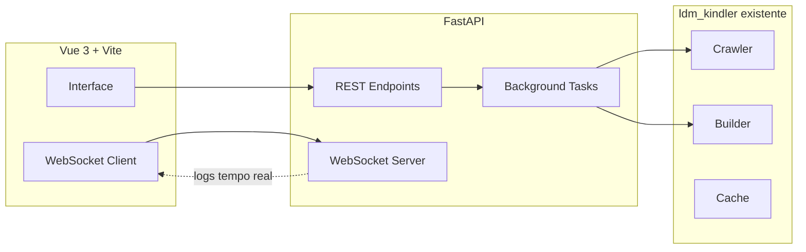

# Plano: Frontend para Kindlemake

## Arquitetura Geral



## Backend (FastAPI)

Criar [`ldm_kindler/api.py`](ldm_kindler/api.py) com:

- **POST /api/jobs** - Iniciar crawling (parâmetros: url_template, range, series_title, author, format)
- **GET /api/jobs** - Listar jobs em execução/finalizados
- **GET /api/jobs/{id}** - Status de um job específico
- **WebSocket /ws/logs/{job_id}** - Stream de logs em tempo real
- **GET /api/library** - Listar arquivos gerados em `./build`
- **GET /api/library/{filename}** - Download do arquivo

Reutilizará a lógica existente em [`ldm_kindler/cli.py`](ldm_kindler/cli.py), refatorando o loop de crawling para emitir eventos.

## Frontend (Vue 3 + Vite)

Estrutura em `frontend/`:

```
frontend/
├── src/
│   ├── views/
│   │   ├── CrawlView.vue    # Formulário de crawling
│   │   ├── LibraryView.vue  # Lista de EPUBs/TXTs
│   │   └── JobView.vue      # Detalhes + logs do job
│   ├── components/
│   │   ├── LogStream.vue    # Console de logs (WebSocket)
│   │   └── FileCard.vue     # Card de arquivo na biblioteca
│   ├── stores/
│   │   └── jobs.js          # Pinia store para jobs
│   └── App.vue
├── package.json
└── vite.config.js
```

**Telas principais:**

1. **Crawl** - Formulário com URL template, faixa, título, autor, formato
2. **Jobs** - Lista de jobs com status (rodando/concluído/erro)
3. **Library** - Grid de arquivos gerados com download

## Estilo Visual

- **Tema escuro** com paleta de tons de âmbar/sépia (estética de e-reader)
- **Fonte display**: Playfair Display para títulos
- **Fonte corpo**: Source Sans 3
- **Animações suaves** com transições CSS e loading states

## Dependências Novas

**Backend** (adicionar ao [`requirements.txt`](requirements.txt)):

```
fastapi>=0.109
uvicorn[standard]>=0.27
python-multipart>=0.0.6
```

**Frontend** (novo `package.json`):

```
vue@3, vite, pinia, vue-router, @vueuse/core
```

## Execução

- **Dev**: `uvicorn ldm_kindler.api:app --reload` + `npm run dev` no frontend
- **Prod**: Build do Vue servido pelo FastAPI como arquivos estáticos